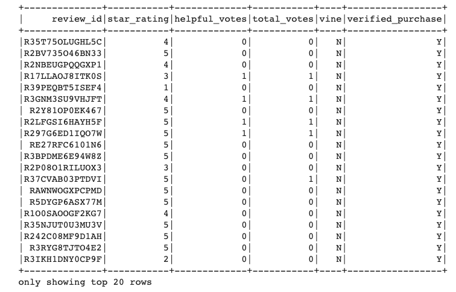
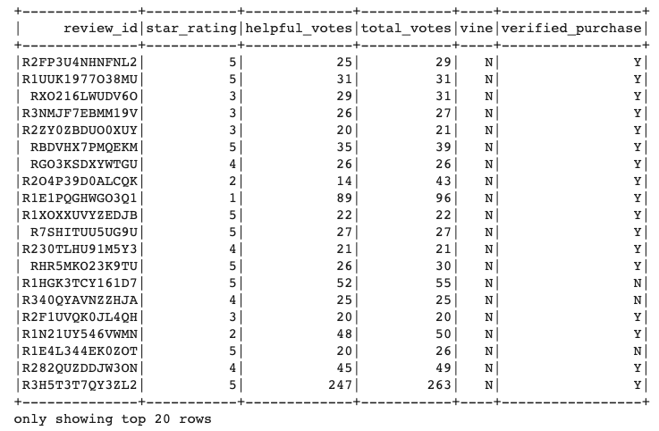
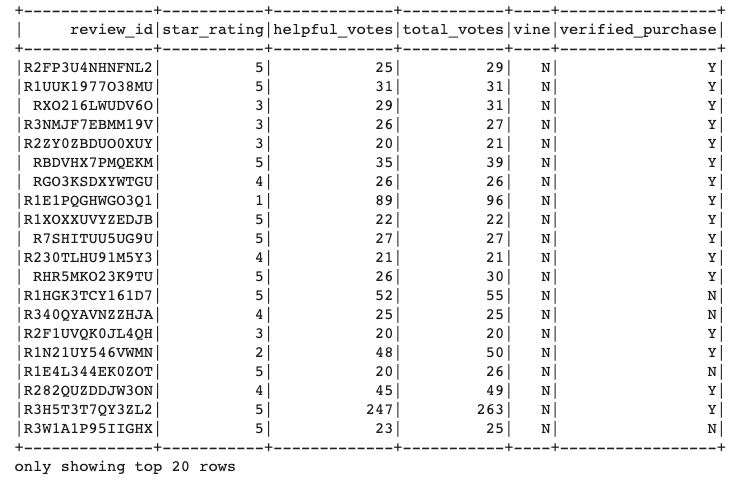
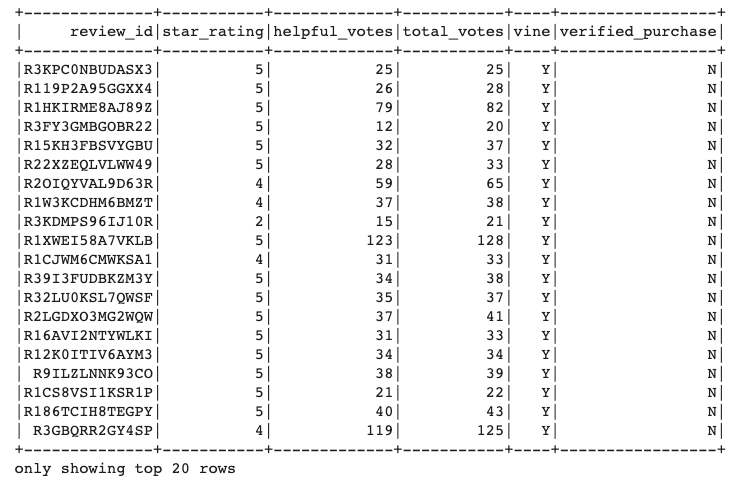
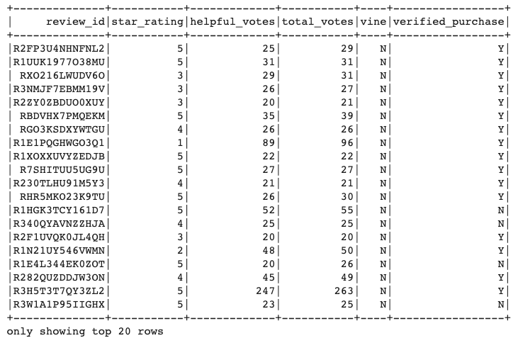

Big data, Hadoop, MapReduce, PySpark, natural language processing (NLP) in relation to big data, and cloud services, Amazon Web Services (AWS).

### Overview of the statistical analysis:

The challenge involves analyzing Amazon reviews written by members of the paid Amazon Vine program. The Amazon Vine program is a service that allows manufacturers and publishers to receive reviews for their products. Companies like SellBy pay a small fee to Amazon and provide products to Amazon Vine members, who are then required to publish a review.

In this project, a dataset is selected from 50 datasets. Each one contains reviews of a specific product, from clothing apparel to wireless products. PySpark is then used to perform the ETL process to extract the dataset, transform the data, connect to an AWS RDS instance, and load the transformed data into pgAdmin. Next, PySpark is used again to determine if there is any bias toward favorable reviews from Vine members in the dataset. 

In this challenge, the following were performed:

- Deliverable 1: *Perform ETL on Amazon Product Reviews*

- Deliverable 2: *Determine Bias of Vine Reviews*

- Deliverable 3: *A Written Report on the Analysis (README.md)*

### Results:

**Deliverable 1:** Perform ETL on Amazon Product Reviews:

Summary: *Using the cloud ETL process, an AWS RDS database was created with tables in pgAdmin, a dataset "amazon_reviews_us_Outdoors_v1_00.tsv.gz" from the Amazon Review datasets was picked and extracted the dataset into a DataFrame. The DataFrame was transformed into four separate DataFrames that matches the table schema in pgAdmin. Then, the transformed data were uploaded into the appropriate tables and run queries in pgAdmin to confirm that the data has been uploaded.* 

**NOTE:**

An error appeared during the data upload to pgAdmin for the products_table. the error states that it was:

*"caused by: org.postgresql.util.PSQLException: ERROR: duplicate key value violates unique constraint "products_table_pkey" Detail: Key duct_id)=(B00IFHFJXI) already exists.*

This error can be seen in the attached "Amazon_Reviews_ETL.ipynb" file.

[Link to the Amazon Reviews ETL.ipynb](https://github.com/jsaltmd/Amazon_Vine_Analysis/blob/main/Amazon_Reviews_ETL.ipynb)

However, it was verified in pgAdmin that the "key duct_id = B00IFHFJXI" is in the pgAdmin products_table as shown below and only one id is in there. All data was also verified that it has successfully migrated in pgAdmin with my tutor Darel Rivera. 

On 012521, this error was brought up during the class and our professor Jon Richards told us to drop the "PRIMARY KEY NOT NULL UNIQUE" when creating the table in postgreSQL. I asked him if I could try that and he said yes and to document it in this report. I reran the data migration to postgreSQL as instructed and it worked with no errors. Refer to the second attached Amazon_Reviews_ETL2 file.

[Link to the Amazon Reviews ETL2.ipynb](https://github.com/jsaltmd/Amazon_Vine_Analysis/blob/main/Amazon_Reviews_ETL2.ipynb)

Below are the actual images of the uploaded data in pgAdmin:

1. **Customers_Table**

2. **Products_Table**

 

3. **Review_ID_Table**

4. **Vine_Table**

**Deliverable 2:** Determine Bias of Vine Reviews:

Summary: Using PySpark, it must be determined if there is any bias towards reviews that were written as part of the Vine program. For this analysis, it has to be determined if having a paid Vine review makes a difference in the percentage of 5-star reviews.

Below are the actual images of the DataFrame created in PySpark:

1. **Vine_DataFrame**

2. **DataFrame where there are 20 or more total votes**

 

3. **DataFrame where the percentage of helpful_votes is equal to or greater than 50%**

4. **DataFrame where there is a Vine review**

5. **DataFrame where there isn’t a Vine review**

6. The total number of reviews is **2302401** 

7. The number of 5-star reviews is **1434884**

8. The percentage 5-star reviews for all Vine is **0.523**

9. The percentage 5-star reviews for non-Vine is **0.526**

**Deliverable 3:** A Written Report on the Analysis:

Summary: For this part of the Challenge, a report that summarizes the analysis that was performed in Deliverable 2 is written. 

As stated under the Deliverable 2 section of this report, the purpose of the analysis was to determine if having a paid Vine review makes a difference in the percentage of 5-star reviews.

**Results:**

[Link to the Vine Review Analysis.ipynb](https://github.com/jsaltmd/Amazon_Vine_Analysis/blob/main/Vine_Review_Analysis.ipynb) 

- How many Vine reviews and non-Vine reviews were there?

Vine reviews: **107**

Non-vine reviews: **39869**

- How many Vine reviews were 5 stars? How many non-Vine reviews were 5 stars?

Vine reviews (5-stars): **56**

Non-vine reviews (5-stars): **21005**

- What percentage of Vine reviews were 5 stars? What percentage of non-Vine reviews were 5 stars?

Percentage of Vine reviews were 5 stars: **0.523**

Percentage of non-Vine reviews were 5 stars: **0.526**

**Results Summary:**

*Based on the results, there is no bias since both 5-star percentage, wether it is paid or unpaid is comparable. The results were discussed with the TA (KK) because she had a different result using the same data. However, I did some calculation verification using the values above and it proves that the results are valid based on the values from the analyzed data.*

**Recommendation:**

*I would recommend to perform additional statistical analysis on the data (mean, std. deviation, etc...) to further support the analysis.*

