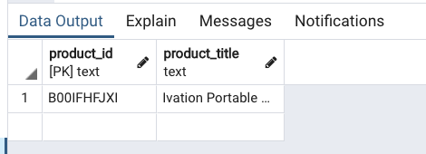
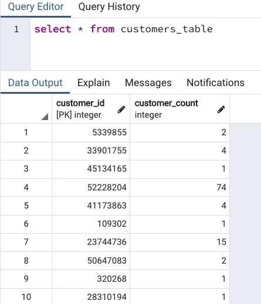
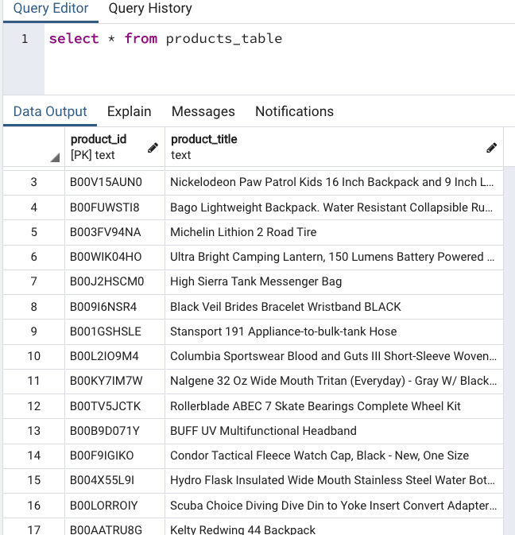
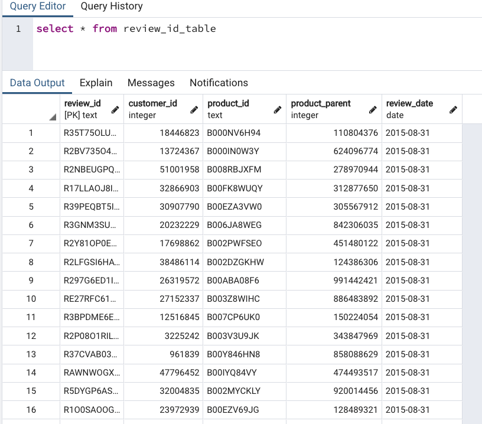
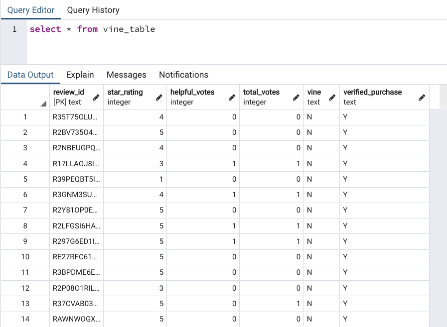
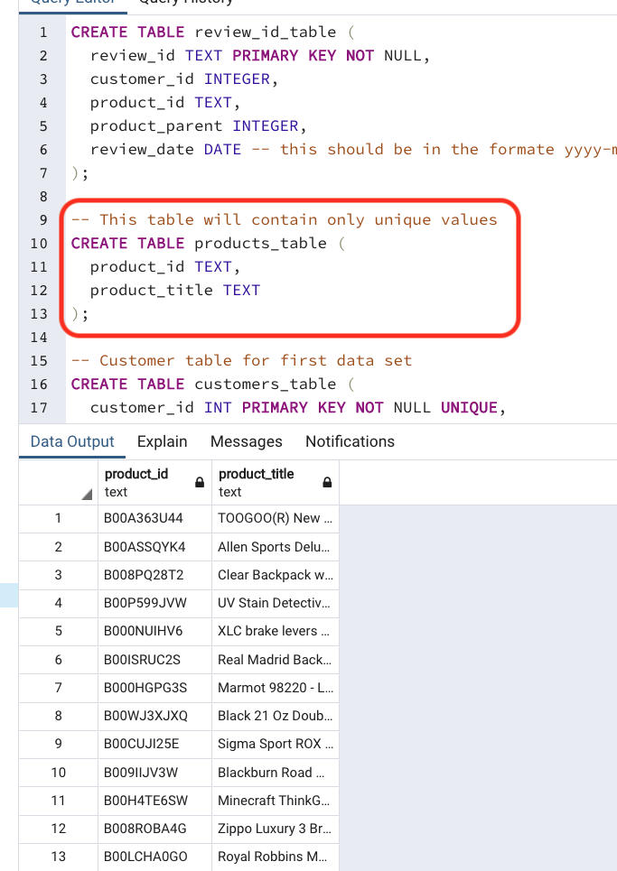

# Amazon_Vine_Analysis
Bg data, Hadoop, MapReduce, PySpark, natural language processing (NLP) in relation to big data, and cloud services, Amazon Web Services (AWS).

### Overview of the statistical analysis:

The challenege involves analyzing Amazon reviews written by members of the paid Amazon Vine program. The Amazon Vine program is a service that allows manufacturers and publishers to receive reviews for their products. Companies like SellBy pay a small fee to Amazon and provide products to Amazon Vine members, who are then required to publish a review.

In this project, a dataset is selected from 50 datasets. Each one contains reviews of a specific product, from clothing apparel to wireless products. PySpark is then used to perform the ETL process to extract the dataset, transform the data, connect to an AWS RDS instance, and load the transformed data into pgAdmin. Next, PySpark is used again to determine if there is any bias toward favorable reviews from Vine members in the dataset. 

In this challenge, the following were performed:

- Deliverable 1: *Perform ETL on Amazon Product Reviews*

- Deliverable 2: *Determine Bias of Vine Reviews*

- Deliverable 3: *A Written Report on the Analysis (README.md)*

### Results:

**Deliverable 1:** Perform ETL on Amazon Product Reviews:

Summary: *Using the cloud ETL process, an AWS RDS database was created with tables in pgAdmin, a dataset "amazon_reviews_us_Outdoors_v1_00.tsv.gz" from the Amazon Review datasets was picked and extracted the dataset into a DataFrame. The DataFrame was transformed into four separate DataFrames that matches the table schema in pgAdmin. Then, the transformed data were uploaded into the appropriate tables and run queries in pgAdmin to confirm that the data has been uploaded.* 

###NOTE:

An error appeared during the data upload to pgAdmin for the products_table. the error states that it was:

*"caused by: org.postgresql.util.PSQLException: ERROR: duplicate key value violates unique constraint "products_table_pkey" Detail: Key duct_id)=(B00IFHFJXI) already exists.*

This error can be verified in the attached "Amazon_Reviews_ETL.ipynb" file. However, it was verified in pgAdmin that the "key duct_id = B00IFHFJXI" is in the pgAdmin products_table as shown below and only one id is in there. All data was also verified that it has successfully migrated in pgAdmin with my tutor Darel Rivera. 

Below are the actual images of the uploaded data in pgAdmin:

1. Customers_Table

2. Products_Table

 

3. Review_ID_Table

4. Vine_Table

**Deliverable 2:** Summary Statistics on Suspension Coils:

Summary: The MechaCar Suspension_Coil.csv dataset contains the results from multiple production lots. In this dataset, the weight capacities of multiple suspension coils were tested to determine if the manufacturing process is consistent across production lots. Using R, the following summary statistics table were created to show:

- The suspension coil’s PSI continuous variable across all manufacturing lots.

Total Summary:

- The following PSI metrics for each lot: mean, median, variance, and standard deviation.

Lot Summary:

1. The design specifications for the MechaCar suspension coils dictate that the variance of the suspension coils must not exceed 100 pounds per square inch. Does the current manufacturing data meet this design specification for all manufacturing lots in total and each lot individually? Why or why not?

*The current manufacturing data meets the design specification (the variance of the suspension coils does not exceed 100 pounds) based on total specification which shows a variance of 62.3 psi. However, if the variance is calculated for each lot, both lot 1 (0.98) and lot 2 (7.47) meets the design specification, which is well below the PSI limit of 100 pounds. Lot 3 exceeds the limit, with a variance of 170.29*

**Deliverable 3:** T-Tests on Suspension Coils:

Summary: *Using R, t-tests were performed to determine if all manufacturing lots and each lot individually are statistically different from the population mean of 1,500 pounds per square inch.*

- t-test results across all manufacturing lots:

- t-test results for each lot:

Mfg. Lot 1

Mfg. Lot 2

Mfg. Lot 3

1. Briefly summarize your interpretation and findings for the t-test results. Include screenshots of the t-test to support your summary.

*For all manufacturing lots, the p-value of the suspension coil for PSI is 0.06 which is above the significance level of 0.05%. Therefore, the importance of finding is normal. When t-test is performed for each lot, the p-values for lot 1 (1) and lot 2 (0.61) are both above the significance level and therefore, the results are not statistically different from the mean population of 1,500 pounds per square inch. The p-value for lot 3 is 0.04 and therefore, it is statistically different from the mean population of 1,500 pounds per square inch.*

**Deliverable 4:** Study Design: MechaCar vs Competition:

Summary: *Write a short description of a statistical study that can quantify how the MechaCar performs against the competition. In your study design, think critically about what metrics would be of interest to a consumer: for a few examples, cost, city or highway fuel efficiency, horse power, maintenance cost, or safety rating.*

In your description, address the following questions:

- What metric or metrics are you going to test?
- What is the null hypothesis or alternative hypothesis?
- What statistical test would you use to test the hypothesis? And why?
- What data is needed to run the statistical test?

1. Horsepower refers to the power an engine produces and since most drivers wants faster cars, it might be worthwile to look into this when comparing how MechaCar performs against the competition. Another interest is fuel efficiency as lowering carbon footprint is important for the invironment and lowering cost is not a bad idea. 

2. A null hypothesis (Ho) can be stated how it is not different from the competitor (*There is no statistical difference between the observed sample mean and its presumed population mean*) and the alternative (Ha) is how it is different (*There is a statistical difference between the observed sample mean and its presumed population mean*).

3. Data from the competitor's vehicles are needed in order to perform a sample t-test.

4. The observed sample mean against the presumed population mean will be used to compare through the t-test.

